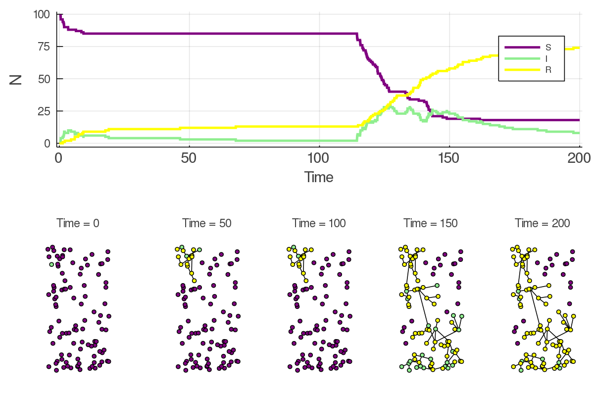

# Pathogen.jl

Authors: Justin Angevaare, Zeny Feng, Rob Deardon

Pathogen.jl is a Julia software package for individual level models of infectious diseases (Deardon et al, 2010). It's capabilities include stochastic simulation and [Bayesian] inference of SEIR, SEI, SIR, and SI individual level models, with fully customizable functions describing individual specific transition rates between disease states (i.e. form of, and relevant risk factors to, susceptibility, transmissibility, transmissability, latency, removal, and sparks functions). Pathogen.jl is written purely in Julia, which enables this generality without incurring performance costs.

Pathogen.jl infers transmission pathways (i.e. who-infected-who). This inference is completed using a Gibbs step in our specialized MCMC algorithm. This specialized MCMC algorithm also performs event time data augmentation.

Examples of Pathogen.jl workflow are included in the examples directory as a Jupyter notebooks.
1. [SIR simulation, inference, and visualization](examples/SIR.md)

