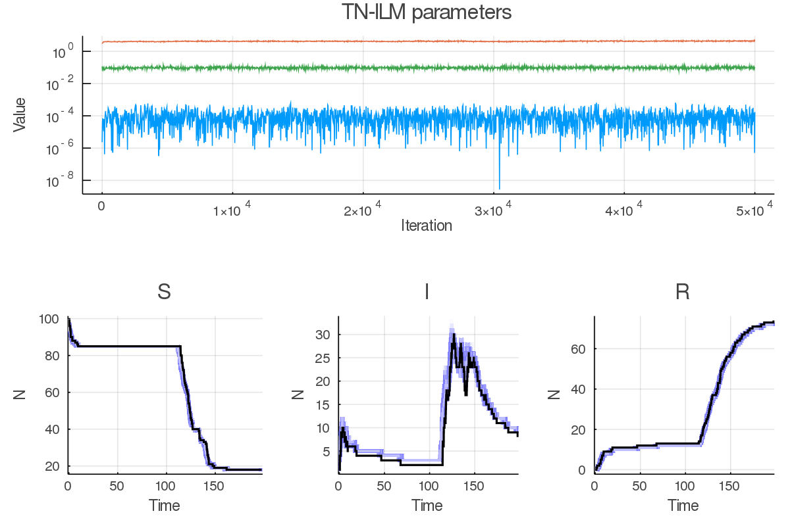

## SIR Transmission Network Individual Level Model (TN-ILM)

```julia
using Distances,
      DataFrames,
      Distributions,
      Pathogen

n = 100
risks = DataFrame(x = rand(Uniform(0, 20), n),
                  y = rand(Uniform(0, 40), n),
                  riskfactor1 = rand(Gamma(), n))

# Precalculate distances
dists = [euclidean([risks[i, :x];
                    risks[i, :y]],
                   [risks[j, :x];
                    risks[j, :y]]) for i = 1:n, j = 1:n]

pop = Population(risks, dists)
```

    Population object (n=100)

<br><br>

```julia
function _constant(params::Vector{Float64}, pop::Population, i::Int64)
  return params[1]
end

function _one(params::Vector{Float64}, pop::Population, i::Int64)
  return 1.0
end

function _linear(params::Vector{Float64}, pop::Population, i::Int64)
  return params[1] * pop.risks[i, :riskfactor1]
end

function _powerlaw(params::Vector{Float64}, pop::Population, i::Int64, k::Int64)
  α = params[1]
  β = params[2]
  d = pop.distances[k, i]
  return α * (d^(-β))
end

rf = RiskFunctions{SIR}(_constant, # sparks function
                        _one, # susceptibility function
                        _powerlaw, # infectivity function
                        _one, # transmissability function
                        _linear) # removal function
```

    SIR model risk functions

<br><br>

```julia
rparams = RiskParameters{SIR}([0.0001], # sparks function parameter(s)
                              Float64[], # susceptibility function parameter(s)
                              [3.0, 4.0], # infectivity function parameter(s)
                              Float64[], # transmissibility function parameter(s)
                              [0.05]) # removal function parameter(s)
```


    SIR model risk function parameters

<br><br>

```julia
starting_states = append!([State_I], fill(State_S, n-1)) # Set first individual as infectious, others as susceptible to start

sim = Simulation(pop, starting_states, rf, rparams)

simulate!(sim, tmax=100.0)
```

    SIR epidemic simulation @ time = 100.7

    S = 1
    I = 23
    R = 76

<br><br>

```julia
using Plots, Plots.PlotMeasures
gr()
```


    Plots.GRBackend()

<br><br>

```julia
# Epidemic Curve
p1 = plot(sim.events, 0.0, 100.0, legendfont=font(6), xaxis=font(10), bottom_margin=30px)

# Population/TransmissionNetwork plots
p2=plot(sim.transmission_network, sim.population, sim.events, 0.0, title="Time = 0", titlefontsize = 8)
p3=plot(sim.transmission_network, sim.population, sim.events, 10.0, title="Time = 10", titlefontsize = 8)
p4=plot(sim.transmission_network, sim.population, sim.events, 30.0, title="Time = 30", titlefontsize = 8)
p5=plot(sim.transmission_network, sim.population, sim.events, 60.0, title="Time = 60", titlefontsize = 8)
p6=plot(sim.transmission_network, sim.population, sim.events, 100.0, title="Time = 100", titlefontsize = 8)
l = @layout [a;
             b c d e f]
combinedplots1 = plot(p1, p2, p3, p4, p5, p6, layout=l)
png(combinedplots1, joinpath(@__DIR__, "epiplot.png"))
```


<br><br>

```julia
anim = @animate for time = range(0.0,100.0,step=1)
    plot(sim.transmission_network, sim.population, sim.events, time, markersize=5, legend=:right, xlim=(-5,30), dpi=120)
end
gif(anim, joinpath(@__DIR__, "epianimation.gif"), fps = 15)
```


<br><br>

```julia
# Generate observations with Uniform(0, 2) observation delay for infection and removal
obs = observe(sim, Uniform(0.0, 2.0), Uniform(0.0, 2.0), force=true)
```


    SIR model observations (n=100)

<br><br>

```julia
# Optimistically assume we know the functional form of epidemic (i.e. use same risk functions used for simulation purposes)
# Specify some priors for the risk parameters of our various risk functions
# Set some extents for event data augmentation

rpriors = RiskPriors{SIR}([Exponential(0.0001)],
                          UnivariateDistribution[],
                          [Uniform(1.0, 5.0); Uniform(1.0, 9.0)],
                          UnivariateDistribution[],
                          [Uniform(0.0, 1.0)])

ee = EventExtents{SIR}(5.0, 5.0)

# Initialize MCMC
mcmc = MCMC(obs, ee, pop, rf, rpriors)
start!(mcmc, attempts=25000) # 1 chain, with 25k initialization attempts
```

    Initialization progress 100%|████████████████████████████| Time: 0:00:39


    SIR model MCMC with 1 chains

<br><br>

```julia
# Run MCMC
iterate!(mcmc, 25000, 1.0, condition_on_network=true, event_batches=10)
```

    MCMC progress 100%|██████████████████████████████████████| Time: 0:19:26


    SIR model Markov chain (iterations = 25000)

<br><br>

```julia
p1 = plot(1:20:25001,
  mcmc.markov_chains[1].risk_parameters, yscale=:log10, title="TN-ILM parameters", xguidefontsize=8, yguidefontsize=8, xtickfontsize=7, ytickfontsize=7, titlefontsize=11, bottom_margin=30px)

p2 = plot(mcmc.markov_chains[1].events[5000], State_S,
          linealpha=0.01, title="S", xguidefontsize=8, yguidefontsize=8,
          xtickfontsize=7, ytickfontsize=7, titlefontsize=11)
for i=5020:20:25000
  plot!(p2, mcmc.markov_chains[1].events[i], State_S, linealpha=0.01)
end
plot!(p2, sim.events, State_S, linecolor=:black)

p3 = plot(mcmc.markov_chains[1].events[5000], State_I,
          linealpha=0.01, title="I", xguidefontsize=8, yguidefontsize=8, xtickfontsize=7, ytickfontsize=7, titlefontsize=11)
for i=5020:20:25000
  plot!(p3, mcmc.markov_chains[1].events[i], State_I, linealpha=0.01)
end
plot!(p3, sim.events, State_I, linecolor=:black)

p4 = plot(mcmc.markov_chains[1].events[5000], State_R,
          linealpha=0.01, title="R", xguidefontsize=8, yguidefontsize=8, xtickfontsize=7, ytickfontsize=7, titlefontsize=11)
for i=5020:20:25000
  plot!(p4, mcmc.markov_chains[1].events[i], State_R, linealpha=0.01)
end
plot!(p4, sim.events, State_R, linecolor=:black)

l = @layout [a; [b c d]]
combinedplots2 = plot(p1, p2, p3, p4, layout=l)
png(combinedplots2, joinpath(@__DIR__, "posterior.png"))
```



<br><br>

```julia
p1 = plot(sim.transmission_network, sim.population, title="True Transmission\nNetwork", titlefontsize=11, framestyle=:box)

tnp = TransmissionNetworkPosterior(mcmc.markov_chains[1].transmission_network[5000:50:25000])
p2 = plot(tnp, sim.population, title="Transmission Network\nPosterior Distribution", titlefontsize=11, framestyle=:box)

combinedplots3 = plot(p1, p2, layout=(1, 2))
png(combinedplots3, joinpath(@__DIR__, "posterior_tn_sbs.png"))
```


<br><br>

```julia
# Convert Risk Parameter MC into an array to summarize
tracedata = convert(Array{Float64, 2}, mcmc.markov_chains[1].risk_parameters)

# Posterior mean estimates
mean(tracedata[5000:50:25000, :], dims=1)
```

    1×4 Array{Float64,2}:
     9.18159e-5  1.00385  2.83247  0.0467462

<br><br>

```julia
# 95% credible intervals
[quantile(tracedata[5000:50:25000, i], j) for j = [0.025, 0.975], i = 1:4]
```


    2×4 Array{Float64,2}:
     1.14966e-6   1.0001   2.7293   0.0368508
     0.000319059  1.01599  2.93087  0.0565685
